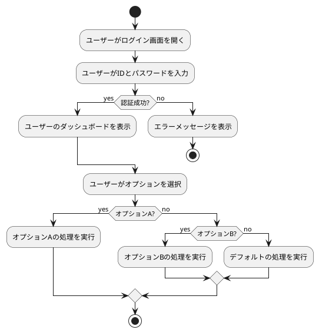

# PlantUML.js

PlantUML that works completely on the browser without needing a server.

Demo URL: [https://plantuml.github.io/plantuml.js/](https://plantuml.github.io/plantuml.js/)

See `examples/` for how to integrate

# Features of the editor

- Auto-rendering

- Image part is pan and zoomable

- Editor part is resizable

- Load from examples

- Ability to send the link with example loaded

## Local development

`npx http-server`

# Sample

